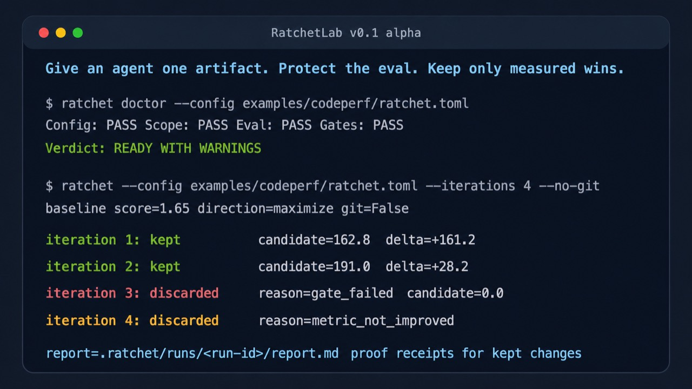

# RatchetLab

An eval-locked improvement loop for agents, prompts, code, and workflows.

**Status:** v0.1 alpha. Local CLI harness. Not a sandbox for untrusted code.

RatchetLab gives an agent one small editable artifact, protects the evaluator, runs a fixed score, and keeps only measured wins. Everything else is discarded and restored.

The pattern is simple:

1. Give an agent **one editable artifact**.
2. Protect the evaluator like it contains the last honest spreadsheet in corporate history.
3. Run a fixed eval.
4. Keep the change only if a scalar metric improves.
5. Log every attempt.
6. Repeat until the machine finds something useful or embarrasses itself loudly.

## Why this exists

Autoresearch is powerful because it turns research into a bounded loop:

```text
proposal -> edit -> evaluate -> keep/discard -> log -> repeat
```

RatchetLab generalizes that loop to prompts, hot-path code, SQL, data recipes, SOPs, automation workflows, and other work where “better” can be measured.

The v0.1 goal is deliberately small: a local CLI harness with a hard trust boundary and inspectable run evidence. No dashboard, no scheduler, no provider framework required.

## Install

From a checkout:

```bash
python3 -m venv .venv
source .venv/bin/activate
python3 -m pip install -e .
```

Then either use the console command:

```bash
ratchet doctor --config examples/codeperf/ratchet.toml
```

Command output starts with the tiny terminal identity:

```text
RatchetLab - keep only measured wins
```

or run the script directly:

```bash
python3 ratchet.py doctor --config examples/codeperf/ratchet.toml
```

## Quick demo, no LLM needed

This demo uses a fake `agent_stub.py` that edits a slow Python function. It proves the harness works before you give a real coding agent permission to touch things. Humanity has enough untested automation already.



From the repo root, run doctor first:

```bash
python3 ratchet.py doctor --config examples/codeperf/ratchet.toml
```

Then run the local demo loop:

```bash
python3 ratchet.py --config examples/codeperf/ratchet.toml --iterations 4 --no-git
```

Expected behavior:

- Doctor validates the config, scope, eval contract, gates, and eval stability without running the agent.
- Baseline runs against `examples/codeperf/target.py`.
- The stub proposes changes.
- Correct, faster changes are kept.
- Broken, gate-failing, or slower changes are discarded and restored.
- Results are written to `.ratchet/codeperf-journal.jsonl` and `.ratchet/runs/`.

## `ratchet doctor`

`ratchet doctor` is a read-only preflight for a loop:

```bash
python3 ratchet.py doctor --config examples/codeperf/ratchet.toml
```

It checks that RatchetLab can safely evaluate the configured project before any agent mutation happens:

- loads and validates the TOML config;
- validates allowed and protected path boundaries;
- reports git/no-git workspace safety status;
- runs the eval three times by default;
- verifies the configured metric is present and numeric;
- verifies optional `gates` are shaped correctly and truthy;
- warns on metric jitter;
- fails if the eval mutates allowed, protected, or otherwise tracked workspace files;
- does **not** run `agent_cmd`.

A passing doctor exits `0` and prints `READY` or `READY WITH WARNINGS`. Contract failures print `NOT READY` and exit non-zero.

## Verify locally

These commands are offline and should pass without an LLM or API key:

```bash
python3 -m unittest discover
python3 ratchet.py doctor --config examples/codeperf/ratchet.toml
python3 ratchet.py --config examples/codeperf/ratchet.toml --iterations 4 --no-git
RATCHET_PROMPTOPT_PROVIDER=mock python3 examples/promptopt/eval.py
RATCHET_PROMPTOPT_PROVIDER=mock python3 ratchet.py --config examples/promptopt/ratchet.toml --iterations 0 --no-git
```

Notes:

- `.ratchet/` contains local run evidence: journals, manifests, candidate diffs, proof receipts, and reports. It is ignored by git.
- `prompt-exports/` is ignored because external planning transcripts and local prompt exports are workshop material, not project source.
- Promptopt mock mode is smoke-only. It verifies evaluator wiring and JSON handling; it is not evidence that a prompt improved.
- Real promptopt scoring requires `OPENAI_API_KEY` and a model explicitly selected with `RATCHET_OPENAI_MODEL`.
- No OpenAI/API key or network call is required for the offline verification commands or CI.

## Eval JSON contract

An eval command must print a JSON object on stdout. The runner parses the last JSON-looking stdout line and reads the configured `metric_name` from it.

Minimum payload:

```json
{
  "score": 0.82
}
```

Recommended payload:

```json
{
  "score": 0.82,
  "gates": {
    "correctness": true,
    "format": true
  },
  "metrics": {
    "accuracy": 0.86,
    "latency_ms": 1200
  },
  "failures": []
}
```

Contract details:

- The configured metric must exist and be numeric.
- `direction` controls whether higher or lower is better.
- `gates` is optional, but if present it must be a JSON object.
- If `gates` is present, every gate value must be truthy or the candidate is rejected even if the scalar metric improves.
- Extra fields are allowed and are preserved in attempt artifacts for debugging.

## Use with a real agent

Replace the `agent_cmd` in a `ratchet.toml` file with your agent command. Examples:

```toml
agent_cmd = "claude -p 'Read program.md, edit only examples/codeperf/target.py, then stop.'"
```

or:

```toml
agent_cmd = "codex exec 'Read program.md. Improve the metric. Edit only the allowed artifact.'"
```

The runner provides these environment variables to the agent command:

- `RATCHET_ITERATION`
- `RATCHET_BEST_METRIC`
- `RATCHET_METRIC_NAME`
- `RATCHET_DIRECTION`
- `RATCHET_ALLOWED_PATHS`
- `RATCHET_PYTHON`

Python child commands can use `{python}` to run under the same interpreter as `ratchet.py`:

```toml
eval_cmd = "{python} examples/codeperf/eval.py"
```

## The five files that matter

```text
ratchet.py                  # generic runner, also exposed as `ratchet` when installed
program.md                  # human steering doc
ratchet.toml                # metric, direction, commands, allowed/protected paths
artifact.ext                # only thing the agent may edit
eval.py                     # immutable evaluator, prints JSON with the metric
```

## Rules that keep this from becoming benchmark confetti

- The eval file is protected.
- The editable scope is tiny.
- Protected or disallowed changes are rejected and restored.
- The metric direction is explicit: maximize or minimize.
- Eval output must include the configured metric as JSON.
- Optional gates can enforce hard requirements before a score counts.
- Changes are kept only if the metric improves.
- Git commits are recommended for real work.

## Example folders

- `examples/codeperf`: fully runnable local demo.
- `examples/promptopt`: OpenAI-backed prompt optimization example with protected dev/holdout eval sets and offline mock mode.

Promptopt model guidance:

- `RATCHET_PROMPTOPT_PROVIDER=mock` is for offline smoke tests only.
- Real scoring requires `OPENAI_API_KEY`.
- Set `RATCHET_OPENAI_MODEL` explicitly for reproducible real runs; model availability changes over time.
- CI intentionally stays offline and does not check OpenAI credentials or model availability.

## Docs

- [Cookbook](docs/cookbook.md): build a small loop, write an eval, and inspect run evidence.
- [Contributing](CONTRIBUTING.md): local checks and contribution boundaries.
- [Security](SECURITY.md): what RatchetLab does and does not sandbox.
- [Release checklist](docs/release-checklist.md): public repo hygiene before tagging.

## Git mode

In a real repo, initialize git first:

```bash
git init
git add .
git commit -m "baseline"
python3 ratchet.py --config examples/codeperf/ratchet.toml --iterations 20
```

Accepted changes are committed. Rejected changes are restored from the pre-attempt snapshot. The journal records both, because forgetting what failed is how humans invented recurring meetings.

## Prior art and inspiration

RatchetLab is inspired by eval-driven iterative improvement and autoresearch patterns: make a change, measure it against a protected eval, keep only measured wins, and preserve evidence.

It does not claim a novel optimization algorithm. The v0.1 value is the small auditable loop: narrow editable scope, protected evaluator, deterministic keep/discard behavior, restoration on failure, and local evidence that a human can inspect.
